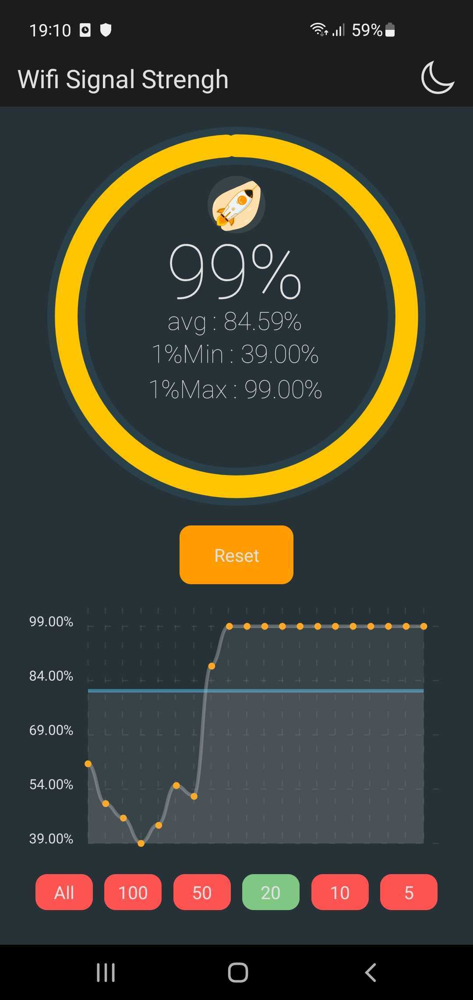
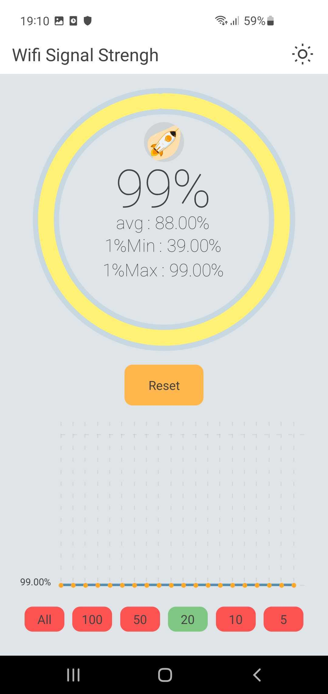

# Wifi Signal Strengh

<p align="center">

</p>

## Stack


## Intro 

This app allow to see the signal strengh of a wifi connexion. Its available only on Play store / Android.

## Get started

```sh
npm i
npm run postinstall
npm start
```

this App is powered by expo. you just have to scan the Qrcode provide after `npm start` to begin work on it

## Publish

### Pre-work

you will maybe need to add the `serviceAccountKeyPath` to the repo. From the root directory :
- `mkdir .secret`
- put your json file given by the play store inside.
- adjust `./eas.json` file at the key `serviceAccountKeyPath` with the path to it.

### Publish to Play Store

```sh
npm run publish
```

## Showcase

<div align="center">


</div>
